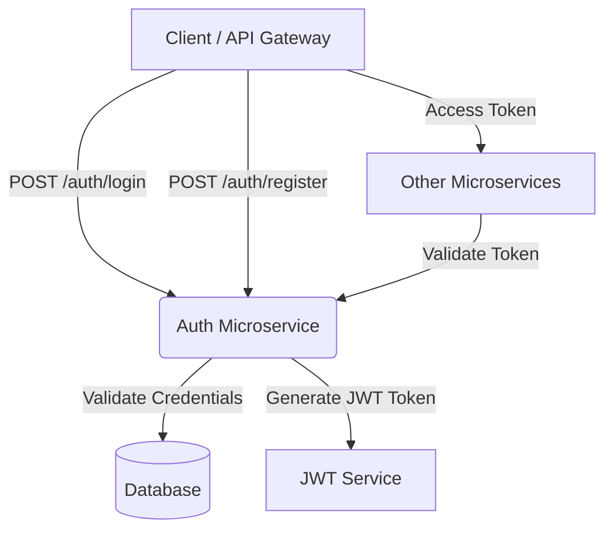

# 🔐 Auth Microservice

This repository contains the **Authentication Microservice** built with **Java 17**, **Spring Boot**, and **Docker**.
It provides secure user authentication and authorization using **JWT (JSON Web Tokens)** and **Spring Security**.
This service is designed as a standalone microservice and can be easily integrated into larger systems such as coding platforms, e-commerce apps, or any microservices architecture.

---

## 🧩 Features

* ✅ User Registration (Sign Up)
* ✅ User Login with JWT Token
* ✅ Role-based Authorization (User, Admin, etc.)
* ✅ Password Encryption using BCrypt
* ✅ Token Refresh Endpoint
* ✅ Secure REST APIs with Spring Security
* ✅ Dockerized for Container Deployment
* ✅ Configurable using `.env` or `application.yml`
* ✅ PostgreSQL Database Integration
* ✅ Actuator Health Check Endpoints

---

##  Tech Stack

| Layer             | Technology                                |
| ----------------- | ----------------------------------------- |
| Language          | Java 17                                   |
| Framework         | Spring Boot 3.x                           |
| Security          | Spring Security + JWT                     |
| Database          | PostgreSQL                                |
| Build Tool        | Maven                                     |
| Containerization  | Docker                                    |
| API Documentation | Swagger / SpringDoc OpenAPI               |
| Configuration     | Environment Variables / `application.yml` |

---

## ⚙️ Architecture Overview



---

##  Getting Started

### 1️⃣ Clone the Repository

```bash
git clone https://github.com/your-username/auth-service.git
cd auth-service
```

---

### 2️⃣ Configure Environment Variables

Create a `.env` file (or use `application.yml`) with the following configuration:

```env
# Server
SERVER_PORT=8081

# Database
DB_URL=jdbc:postgresql://localhost:5432/authdb
DB_USERNAME=postgres
DB_PASSWORD=yourpassword

# JWT Configuration
JWT_SECRET=mysecretkey
JWT_EXPIRATION=3600000  # 1 hour

# Spring Profile
SPRING_PROFILES_ACTIVE=dev
```

---

##  Build and Run Locally

### Using Maven

```bash
mvn clean install
mvn spring-boot:run
```

The service will start at:
 `http://localhost:8081`

---

## 🐳 Run with Docker

### 1️⃣ Build Docker Image

```bash
docker build -t auth-service:latest .
```

### 2️⃣ Run the Container

```bash
docker run -d -p 8081:8081 --env-file .env auth-service:latest
```

### 3️⃣ Using Docker Compose (Optional)

```bash
docker-compose up --build
```

---

## 🧩 API Endpoints

| Method | Endpoint           | Description                         | Auth Required |
| ------ | ------------------ | ----------------------------------- | ------------- |
| POST   | `/auth/register`   | Register a new user                 | ✅            |
| POST   | `/auth/login`      | Authenticate and generate JWT token | ✅            |
| POST   | `/auth/refresh`    | Refresh expired JWT token           | ✅            |
| GET    | `/auth/me`         | Get logged-in user details          | ✅            |
| GET    | `/actuator/health` | Health check                        | ✅            |

---

### 🧪 Example Requests

#### Register a User

**POST** `/auth/register`

```json
{
  "username": "john_doe",
  "email": "john@example.com",
  "password": "securePassword123"
}
```

**Response**

```json
{
  "message": "User registered successfully",
  "userId": "c1f4e123-abcd-45ef-9234-1234abcd5678"
}
```

---

#### Login

**POST** `/auth/login`

```json
{
  "email": "john@example.com",
  "password": "securePassword123"
}
```

**Response**

```json
{
  "token": "eyJhbGciOiJIUzI1NiIsInR5cCI6IkpXVCJ9...",
  "expiresIn": 3600000
}
```

---

##  JWT Authentication Flow

1. The user sends login credentials to `/auth/login`.
2. The service validates credentials and generates a JWT.
3. The JWT is returned to the client.
4. The client attaches the token in the `Authorization` header for subsequent requests.
5. Each protected endpoint verifies the token before granting access.

---

## Useful Commands

| Command                          | Description             |
| -------------------------------- | ----------------------- |
| `mvn test`                       | Run all unit tests      |
| `mvn package`                    | Build the JAR file      |
| `docker build -t auth-service .` | Build Docker image      |
| `docker ps`                      | List running containers |
| `docker logs <container_id>`     | View service logs       |

---

##  API Documentation (Swagger)

Once the service is running:

 Swagger UI: `http://localhost:8081/swagger-ui.html`
 OpenAPI Spec: `http://localhost:8081/v3/api-docs`

---

##   Future Enhancements

* OAuth2 / Social Login (Google, GitHub)
* Email Verification Workflow
* Password Reset via Email or OTP
* Redis-based Token Blacklisting
* Rate Limiting and IP Blocking

---

##  Contributing

1. Fork this repository
2. Create a new branch: `git checkout -b feature/your-feature`
3. Commit your changes: `git commit -m "Add new feature"`
4. Push to your branch: `git push origin feature/your-feature`
5. Create a Pull Request 🎉

---

##   License

This project is licensed under the **MIT License**.
See the [LICENSE](./LICENSE) file for details.

---
